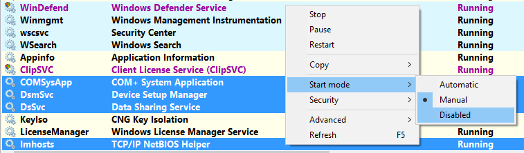
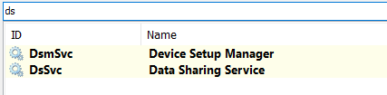
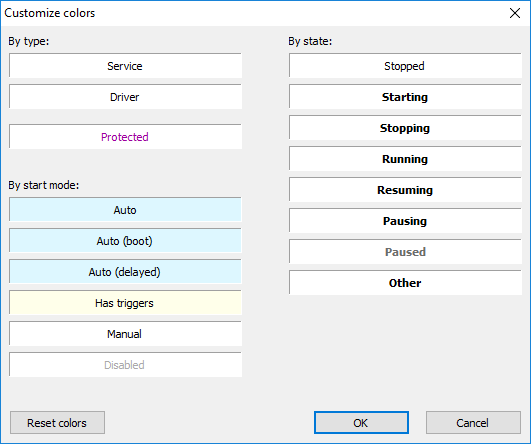
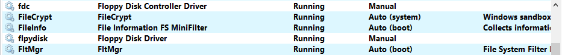
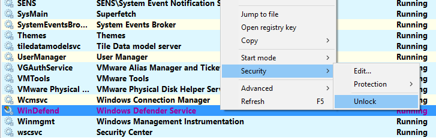
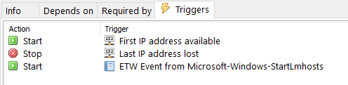
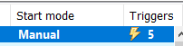
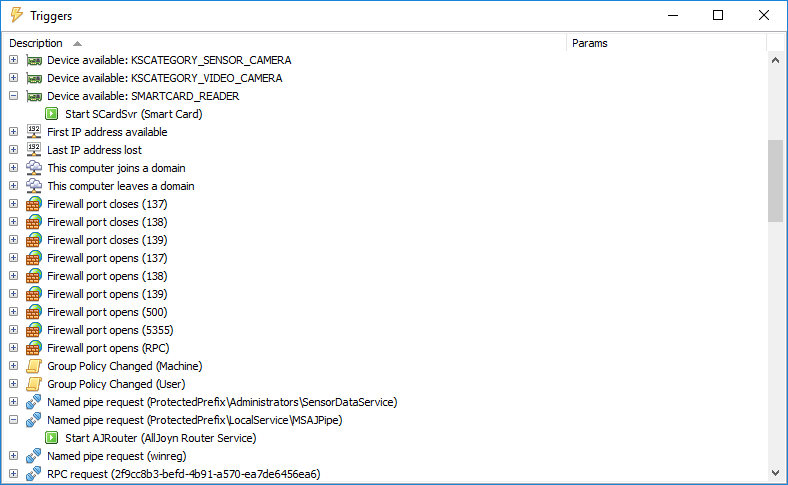
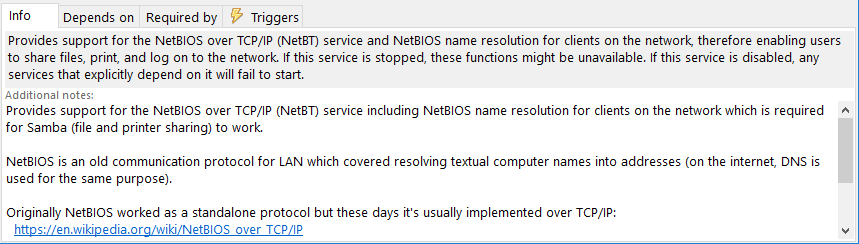
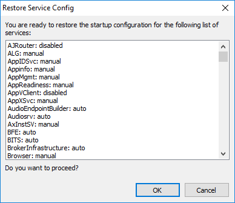

Viper features
==============

* Start, stop or reconfigure multiple services at once
* Change start mode from right-click menu

    

* Quicksearch - filter as you type

    

* Colors - customize how services look in different states

    

* Soft refresh - update service list without losing the context

* Drivers can be shown alongside services

    

Security editor
---------------

* Change service access permissions

* Unlock protected services with one click

    

Service triggers
----------------

* Service triggers in the bottom pane - with user-friendly names where possible.

    

* Triggers are reflected in the list

    

* Trigger browser is also available

    

Categories
----------

* Group your services as you see fit

* Drag and drop services between folders

* Rename your services without affecting their Windows registration data.

    

* Write custom user-defined notes

    

Management
------------

* Save and load services auto-start configuration

    

* Export the service and/or delete it
