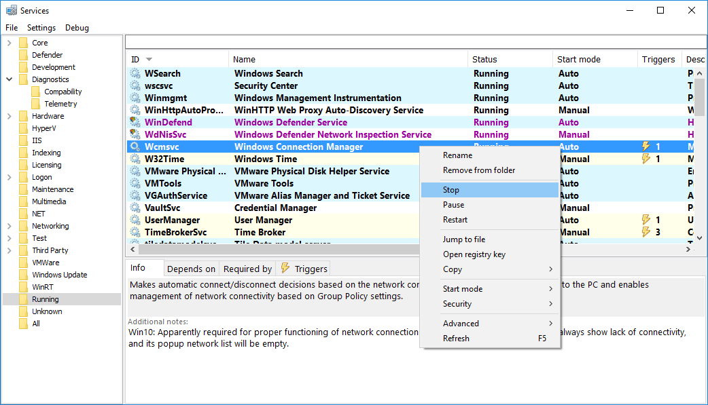

# Viper: Enhanced service manager

## Features
* Start, stop or reconfigure multiple services at once
* Change start mode from right-click menu
* Quicksearch - filter as you type
* Colors - customize how services look in different states
* Soft refresh - update service list without losing the context
* Drivers can be shown alongside services

## Security editor
* Security editor - change service access permissions
* Unlock protected services with one click

## Triggers
* Service triggers - with user-friendly names where possible
* Trigger browser is also available

## Categories
* Categories - group your services as you see fit
* Custom user-defined notes
* Rename services

## Management
* Save and load services auto-start configuration
* Export the service and/or delete it

[More details](Docs/)

# Q&A

Q: Why is this called Viper.

A: Because it needed a name... This is also a tribute to BlackViper's site which is now down or something.